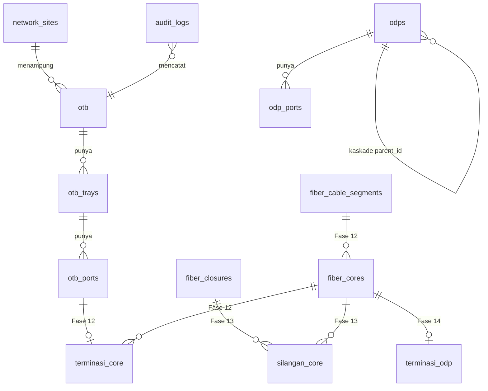

# OTB, Rute Core, Silangan Closure, dan Master Splitter

| | |
|---|---|
| Produk | Portal NOC PerumNet (`monitoring-noc`) |
| Stack | Next.js + **Drizzle ORM** + better-auth + PostgreSQL |
| Versi | 2.0 — disesuaikan ke portal NOC, 21 Agustus 2026 |
| Status | **Fase 11–15 selesai.** Fase 16 belum. |
| Sifat perubahan | Aditif; tidak ada tabel existing yang diubah bentuknya |

> **Asal dokumen.** Kebutuhan di sini datang dari sebuah PRD yang ditulis untuk
> app lain (Prisma, produk "PERUMNET CRM & Operations"), diterima 21 Agustus
> 2026. Dokumen asli disimpan apa adanya di
> `docs/arsip/PRD-OTB-ASLI-PRISMA.md`. **Jangan dipakai sebagai acuan kerja** —
> stack, nama model, daftar permission, dan klaim statusnya tidak berlaku di
> sini. Yang diambil darinya adalah aturan domainnya (§3 di bawah), dan itu
> memang bagian yang paling berharga.
>
> Satu hal yang perlu diingat tentang dokumen asli: ia menandai Fase A–J
> "Selesai", padahal `OTBTray`, `MasterSplitter*`, dan `ODPFiberTermination`
> tidak ada di repo PerumNet mana pun. Diperiksa langsung, bukan disimpulkan.
> Karena itu **dokumen ini menyebut status hanya kalau ada tes dan migrasi yang
> membuktikannya.**

---

## 1. Untuk apa modul ini

Mencatat topologi fiber dari perangkat aktif sampai ONT pelanggan, dalam bentuk
yang bisa ditelusuri dan diaudit. Pertanyaan yang harus bisa dijawab:

- Port OTB mana yang menyuapi ODP tertentu?
- Tray, port, kabel, core, dan closure mana saja yang dilewati?
- Apakah nomor core berubah saat melewati closure?
- Master splitter mana yang membagi feeder ke beberapa ODP?
- Berapa panjang jalur fisiknya, dan berapa estimasi rugi optiknya?
- Di titik mana jalurnya putus, berputar, atau terminasinya belum lengkap?
- Siapa yang mengubah topologi ini, kapan, dan dengan alasan apa?

Portal ini sudah bisa menjawab lapisan akses (OLT → ODP → port → pelanggan).
Yang belum: apa pun **di antara** OLT dan ODP — dan justru di situlah gangguan
kabel terjadi.

## 2. Masalah yang dipecahkan

Data fiber yang hanya berupa nama kabel dan catatan core di spreadsheet tidak
cukup. Tanpa hubungan fisik yang terstruktur:

- Core yang sama dipakai dua koneksi aktif tanpa ada yang tahu.
- Perubahan nomor core di closure tidak tercatat, jadi trace berhenti di situ.
- Closure biasa dipakai sebagai titik pembagi tanpa perangkat splitter yang jelas.
- Panjang rute jadi perkiraan, atau dihitung dua kali.
- ODP diperlakukan sebagai titik transit, padahal ia ujung.
- Teknisi menelusuri dokumen manual saat gangguan — dan itu yang paling mahal.

## 3. Aturan domain — bagian yang tidak boleh dilanggar

Ini inti dokumen asli, dan berlaku apa adanya di sini.

### 3.1 Jalur feeder

```text
Port perangkat → patch → port OTB → core feeder
→ closure/silangan → core feeder
→ input Master Splitter
```

Feeder boleh melewati lebih dari satu closure. Nomor core **boleh berubah** di
closure, dan perubahan itu wajib tercatat sebagai edge yang sebenarnya —
misalnya Core 17 menjadi Core 23.

### 3.2 Jalur distribution

```text
Output Master Splitter → core distribution
→ closure/silangan → core distribution
→ ODP → ONT pelanggan
```

Tiap output master splitter adalah jalur mandiri. Menelusuri satu output tidak
boleh mencampur jalur output lain.

### 3.3 Tujuh aturan wajib

1. **ODP adalah ujung distribusi.** Tidak pernah jadi simpul penerus feeder
   atau backbone.
2. **Closure normal tidak boleh membagi** satu input jadi beberapa output.
   Pembagian optik hanya boleh lewat master splitter yang eksplisit.
3. **Konektor dan polish adalah dua atribut terpisah.** Layar boleh menulis
   "LC/APC"; database tidak boleh.
4. **Port fisik punya identitas permanen.** Nomor yang sudah terbit tidak
   pernah dipakai ulang dan tidak pernah digeser.
5. **Panjang berasal dari segmen kabel**, bukan angka yang diketik di layar.
6. **Estimasi rugi optik tidak boleh dilabeli hasil pengukuran.** Kalau kelak
   ada data OTDR, ia ditampilkan terpisah.
7. **Histori tidak dihapus.** Koneksi yang diganti dinonaktifkan, bukan
   ditimpa.

Aturan 1–3 dan 7 harus ditegakkan **di server**. UI bukan sumber kebenaran
otorisasi maupun okupansi.

---

## 4. Apa yang sudah ada di portal ini

Dokumen asli punya tabel "reuse" yang menandai belasan model sebagai
"Existing—reuse". Itu benar untuk app asalnya, **bukan untuk sini**. Berikut
keadaan sebenarnya, diperiksa langsung terhadap `src/db/schema.ts` dan database
produksi pada 21 Agustus 2026.

### 4.1 Sudah ada — pakai ini, jangan bikin tandingannya

| Tabel Drizzle | Isi produksi | Perannya di modul ini |
|---|---|---|
| `network_sites` | 6 | Lokasi OTB dan closure |
| `olt_devices` | 6 | Pangkal jalur feeder |
| `odps` | 577 | **ODP dan master splitter** — lihat §4.2 |
| `odp_ports` | 8.632 | Port ODP; ujung jalur distribution |
| `odp_customers` | 1.687 | Kaitan ke pelanggan, tanpa data pribadi |
| `audit_logs` | generik | Riwayat seluruh mutasi topologi |
| `assets` | — | Perangkat terpantau (LibreNMS) |
| `otb`, `otb_trays`, `otb_ports` | 0 | **Fase 11 — sudah dibuat** |
| `fiber_cable_segments`, `fiber_cores`, `fiber_core_terminations` | 0 | **Fase 12 — sudah dibuat** |
| `fiber_closures`, `fiber_core_splices` | 0 | **Fase 13 — sudah dibuat** |

### 4.2 Master Splitter TIDAK dibuat tabel baru

Dokumen asli meminta `MasterSplitter`, `MasterSplitterPort`, dan
`MasterSplitterCoreTermination` sebagai tabel terpisah. **Di portal ini
permintaan itu ditolak, dengan sengaja.**

Master splitter sudah ada sebagai `odps` yang `role = 'MS'`:

- **63 baris produksi**, seluruhnya berstatus ACTIVE. 62 dari 63 punya
  koordinat — satu yang belum akan tampak sebagai lubang di peta Fase 15,
  bukan sebagai galat.
- Rasio splitter tersimpan di `capacity` — 59 buah bernilai 8 (1:8), 4 buah
  bernilai 16 (1:16).
- Kaskade lewat `parent_id`, sedalam 11 tingkat; 59 MS ada di tingkat 2.
- Port-nya ada di `odp_ports`, sama seperti ODP.

Alasan penolakannya ada tiga, dan yang ketiga datang dari dokumen aslinya
sendiri:

1. Tabel baru akan **menduplikasi 63 baris nyata** yang sudah dipakai produksi.
2. `src/server/outage.ts` mendeteksi gangguan massal dengan menelusuri `odps`.
   Memindahkan MS ke tabel lain memutus deteksi itu tanpa ada tes yang merah.
3. Dokumen asli §7 menulis sendiri: *"Tidak boleh dibuat master paralel untuk
   ODP."* Membuat `master_splitters` melanggar aturannya sendiri.

Alasan lengkapnya tertulis di komentar tabel `odps` pada `src/db/schema.ts`.

### 4.3 Belum ada, dan memang harus dibangun

Layar riwayat topologi (Fase 16). Mesin trace dan peta tidak menambah tabel
apa pun — keduanya menurunkan hasilnya dari yang sudah dicatat.

### 4.4 Tidak ada di portal ini, dan tidak direncanakan

| Diminta dokumen asli | Kenapa tidak |
|---|---|
| `WorkOrder` | Tidak ada di portal ini. Referensi perubahan memakai `audit_logs` + alasan tertulis. |
| OTDR (sesi, pengukuran, lampiran) | Tidak ada alat maupun datanya. Kalau kelak ada, itu fase tersendiri. |
| `DevicePort`, `OpticalCircuit` | Belum dibutuhkan; jalur dimulai dari port OTB. |
| `NetworkNode` sebagai registry terpisah | `network_sites` + koordinat per entitas sudah cukup. |
| `SuperPop`, `DataCenterRack`, `DataCenterAsset` | Milik app lain. |
| Scope company/branch | Portal ini satu perusahaan. Lihat §7. |

Menyeludupkan salah satu dari daftar ini ke fase mana pun bukan penambahan
kecil — masing-masing menarik subsistemnya sendiri.

---

## 5. Model data

Nama tabel dan kolom memakai `snake_case`; properti TypeScript `camelCase`.
Enum ditulis inline (`text("status", { enum: [...] })`) — repo ini **tidak
memakai `pgEnum` sama sekali**. Primary key selalu `text("id")` diisi
`randomUUID()`.



Nama untuk Fase 12–16 di atas masih usulan; yang mengikat baru `otb*`.

### 5.1 Constraint yang menegakkan aturan domain

Aturan domain yang hanya dijanjikan kode aplikasi akan ditepati sampai suatu
hari tidak. Yang bisa dinyatakan sebagai constraint, dinyatakan:

| Aturan | Ditegakkan oleh | Status |
|---|---|---|
| Satu port per slot tray | `uniqueIndex(tray_id, port_number_in_tray)` | ✅ Fase 11 |
| Satu "Core 17" per OTB | `uniqueIndex(otb_id, global_port_number)` | ✅ Fase 11 |
| Port tidak bisa mengaku milik OTB lain | FK gabungan `(tray_id, otb_id)` → `otb_trays(id, otb_id)` | ✅ Fase 11 |
| Nomor tray unik per OTB | `uniqueIndex(otb_id, tray_number)` | ✅ Fase 11 |
| Satu ujung core hanya punya satu terminasi aktif | `fiber_term_core_end_idx`, parsial | ✅ Fase 12 |
| Satu port OTB hanya ditempati satu terminasi aktif | `fiber_term_otb_port_idx`, parsial | ✅ Fase 12 |
| Satu port ODP hanya ditempati satu terminasi aktif | `fiber_term_odp_port_idx`, parsial | ✅ Fase 12 |
| Terminasi wajib menempel tepat di satu port | CHECK `fiber_term_sasaran_check` | ✅ Fase 12 |
| Port yang membawa core tidak bisa dihapus | FK `restrict` ke `otb_ports`/`odp_ports` | ✅ Fase 12 |
| Satu ujung core masuk hanya punya satu sambungan aktif (larangan membagi) | `fiber_splice_input_idx`, parsial | ✅ Fase 13 |
| Satu ujung core keluar hanya ditempati satu sambungan aktif | `fiber_splice_output_idx`, parsial | ✅ Fase 13 |
| Core tidak bisa disambung ke dirinya sendiri | CHECK `fiber_splice_bukan_diri_check` | ✅ Fase 13 |
| Closure/core yang punya silangan tidak bisa dihapus | FK `restrict` | ✅ Fase 13 |

Pola *partial unique index* sudah punya preseden di repo ini:
`incidents_active_alert_idx` di `src/db/schema.ts`. Itu mekanisme yang dokumen
asli sebut "active occupancy key".

---

## 6. Endpoint

Semua di bawah `/api/v1/ftth/`, mengikuti keluarga yang sudah ada
(`/ftth/odps`, `/ftth/olts`). Aturan yang berlaku untuk semuanya:

- `export const dynamic = "force-dynamic"`.
- **Wajib** dibungkus `withRole` dari `src/server/rbac.ts`. `src/proxy.ts`
  mengecualikan `/api` dari pemeriksaan sesi, jadi `withRole` adalah
  satu-satunya penjaga. `tests/no-unguarded-route-guard.test.ts` menggagalkan
  build untuk `route.ts` baru yang lupa memasangnya.
- Bentuk galat selalu `{ "error": "kalimat bahasa Indonesia" }`.
- GET data hidup memakai `Cache-Control: no-store`.
- Tidak ada Zod di repo ini; validasi body ditulis tangan.
- Logika domain tinggal di `src/server/**`, bukan di handler.

### 6.1 Sudah hidup (Fase 11)

| Endpoint | Peran | Untuk |
|---|---|---|
| `GET /api/v1/ftth/otb` | `[]` | Daftar OTB + hitungan turunan |
| `POST /api/v1/ftth/otb` | `admin`, `noc` | Buat OTB + tray + port, satu transaksi |
| `GET /api/v1/ftth/otb/:otbId` | `[]` | Kepala OTB + tray berlencana status |
| `GET …/trays/:n/ports` | `[]` | Isi satu tray |
| `PATCH …/trays/:n/ports` | `admin`, `noc`, `engineer` | Ubah satu port |
| `PATCH …/trays/:n` | `admin`, `noc` | Ubah kapasitas tray |
| `PATCH /api/v1/ftth/otb/:otbId` | `admin`, `noc` | Ubah atribut OTB (Fase 12) |
| `GET/POST /api/v1/ftth/cables` | `[]` / `admin`,`noc` | Kabel + core-nya |
| `GET /api/v1/ftth/cables/:cableId` | `[]` | Kabel + seluruh core |
| `POST /api/v1/ftth/terminations` | `admin`, `noc` | Terminasi ujung core ke port |
| `POST …/terminations/:id/release` | `admin`, `noc` | Lepas terminasi (non-destruktif) |
| `GET/POST /api/v1/ftth/closures` | `[]` / `admin`,`noc` | Closure |
| `GET /api/v1/ftth/closures/:id` | `[]` | Matriks silangan (`?riwayat=1`) |
| `POST …/closures/:id/splices/preview` | `admin`, `noc` | Pratinjau, tanpa menulis |
| `POST …/closures/:id/splices` | `admin`, `noc` | Pasang batch, atomik |
| `POST /api/v1/ftth/splices/:id/release` | `admin`, `noc` | Lepas silangan |
| `GET /api/v1/ftth/trace` | `[]` | Telusur jalur dua arah + diagnosis |
| `GET /api/v1/ftth/geo` | `[]` | Simpul & garis jalur untuk peta |

Kontrak lengkapnya — bentuk respons, kode galat, dan larangan untuk frontend —
ada di `docs/HANDOFF-BACKEND-KE-FRONTEND.md` §16 (OTB), §17 (kabel/core), §18 (closure), §19 (trace), dan §21 (peta). Dokumen itu yang mengikat;
tabel di atas hanya ringkasan.

### 6.2 Direncanakan

| Endpoint | Fase | Untuk |
|---|---|---|

**Tidak ada `DELETE` untuk OTB, dan itu disengaja.** FK-nya cascade, jadi satu
DELETE memusnahkan seluruh tray, port, dan membuat setiap `entity_id` di
`audit_logs` menunjuk baris yang tidak ada — padahal jejak itulah yang dipakai
untuk menolak penghapusan port berriwayat. Cara menonaktifkan OTB adalah
`status: "nonaktif"`.

### 6.3 Setiap mutasi wajib

1. Terautentikasi (`withRole`).
2. Memvalidasi status entitas dan jenis core.
3. Memeriksa okupansi lewat constraint database, bukan hanya kode.
4. Berjalan dalam `db.transaction`.
5. Menulis `audit_logs` **di dalam transaksi yang sama**, sehingga kegagalan
   audit membatalkan mutasinya. Pola: `src/server/topology-store.ts`.

---

## 7. Peran dan akses

Dokumen asli memuat tujuh peran dan tiga belas permission bergranularitas
halus, lengkap dengan scope company/branch. **Portal ini tidak punya satu pun
dari itu.** Yang ada empat peran, tanpa scope perusahaan:

| Kemampuan | `admin` | `noc` | `engineer` | `manajemen` |
|---|---|---|---|---|
| Lihat OTB, tray, port | ✅ | ✅ | ✅ | ✅ |
| Ubah status port | ✅ | ✅ | ✅ | ❌ |
| Buat OTB, ubah kapasitas | ✅ | ✅ | ❌ | ❌ |
| Kelola silangan closure (Fase 13) | ✅ | ✅ | ❌ | ❌ |
| Terminasi core ke ODP (Fase 12) | ✅ | ✅ | ❌ | ❌ |

`engineer` bisa menandai port terpakai karena itu memang pekerjaan teknisi di
lapangan; ia tidak bisa membuat atau mengecilkan rak.

Memetakan tujuh peran dokumen asli ke empat peran ini **bukan pekerjaan
sepele** dan bukan bagian modul ini. Kalau kelak dibutuhkan, itu fase
tersendiri yang menyentuh better-auth dan seluruh endpoint yang ada.

---

## 8. Peta fase

| Fase | Isi | Status |
|---|---|---|
| **11** | OTB, tray, port | ✅ **Selesai, terpasang di produksi 21 Agustus 2026** |
| 12 | Kabel, core, terminasi core→port, okupansi | ✅ **Selesai 21 Agustus 2026** |
| 13 | Closure dan silangan core; larangan pembagian | ✅ **Selesai 21 Agustus 2026** |
| 14 | Mesin trace feeder/distribution + diagnosis | ✅ **Selesai 21 Agustus 2026** |
| 15 | Garis jalur di peta + fanout MS→ODP | ✅ **Selesai 22 Agustus 2026** |
| 16 | Riwayat topologi di atas `audit_logs` | Belum |

### 8.1 Fase 11 — apa yang benar-benar ada

Bukan pernyataan; ini yang bisa diperiksa:

- Migrasi `drizzle/pg/0008_otb_tray_port.sql`, terpasang di produksi dan
  tercatat di `drizzle.__drizzle_migrations`.
- Tabel `otb`, `otb_trays`, `otb_ports` beserta lima index dan FK gabungannya.
- `src/server/otb-store.ts` — seluruh aturan domain.
- Empat berkas `route.ts` di `src/app/api/v1/ftth/otb/**`.
- `tests/otb-status-tray.test.ts`, `tests/otb-routes.test.ts`,
  `tests/otb-kapasitas.test.ts`. Suite: 414 → 453 saat fase ini mendarat.
- Layar `/ftth/otb` dan `/ftth/otb/[otbId]` (T-24, dikerjakan Luna).

Empat mutasi diuji terhadap kode yang **salah** dan masing-masing menghasilkan
kegagalan yang tepat — termasuk kasus "port pernah terpakai lalu dibebaskan",
yang lolos pada implementasi yang hanya melihat `status`.

### 8.2 Aturan penurunan kapasitas — dan kenapa ia tetap benar nanti

Port yang akan hilang boleh dilepas hanya kalau **kosong**, **tidak memegang
`external_service_id`**, dan **tidak punya jejak di `audit_logs`**.

Syarat ketiga yang penting: port yang pernah terpakai lalu dibebaskan terlihat
identik dengan port yang belum pernah dipakai. Bedanya hanya jejak.

Aturan ini tidak perlu ditulis ulang saat core datang di Fase 12 — core yang
terpasang membuat port tidak lagi `kosong`, jadi ia ikut terlindungi. Syaratnya
satu: **FK dari tabel terminasi ke `otb_ports.id` memakai `RESTRICT`, bukan
`CASCADE`.**

---

## 9. Migrasi dan rollout

Migrasi **aditif**; tidak ada kolom atau tabel existing yang diubah bentuknya.
Migrasi lama tidak pernah diedit — `drizzle-kit generate` selalu menghasilkan
berkas baru.

**Prosedur menerapkan ke produksi ada di `docs/OPERATIONS.md` §13, dan bukan
`npx drizzle-kit migrate`.** Perintah itu benar untuk dev saja. Baca juga §13.1
soal tabel pelacak yang pernah melenceng tanpa gejala apa pun.

Urutannya selalu: **skema dulu, kode belakangan.** Kode baru yang menemui tabel
lama akan 500; tabel baru yang belum dipakai kode lama tidak melakukan apa-apa.

Setiap fase mengikuti sebelas langkah di `docs/WORKFLOW-TIM.md` §3 — termasuk
memastikan migrasi naik bersih **dari nol**, bukan hanya sebagai selisih. Itu
sudah terjaga otomatis: setiap tes DB membangun PGlite baru lalu menjalankan
seluruh `drizzle/pg/*.sql` berurutan.

---

## 10. Kriteria selesai per fase

Sebuah fase selesai kalau **ada tes yang gagal terhadap kode sebelum
perbaikan** (`docs/WORKFLOW-TIM.md` §4). Daftar ini kriteria, bukan janji.

### Fase 11 — OTB ✅

- [x] OTB SC bawaan 12 port/tray, LC bawaan 24 — dan angka lain tetap diterima
- [x] Konektor dan polish tersimpan sebagai dua kolom
- [x] Nomor global tidak bergeser saat kapasitas berubah
- [x] Port tidak bisa mengaku milik OTB lain daripada tray-nya
- [x] Penurunan kapasitas ditolak untuk port tidak kosong atau berriwayat
- [x] Pembuatan gagal di tengah tidak meninggalkan OTB yatim
- [x] Dua OTB boleh sama-sama punya "Core 17"

### Fase 12 — kabel dan core ✅

- [x] Core punya jenis: feeder atau distribution
- [x] Core non-distribution ditolak sebagai terminasi ODP
- [x] Satu ujung core tidak bisa punya dua terminasi aktif — ditolak **database**
- [x] Satu port tidak bisa ditempati dua terminasi aktif — ditolak **database**
- [x] Dua permintaan bersamaan tidak menghasilkan okupansi ganda
- [x] Melepas terminasi tidak menghapus riwayatnya
- [x] Port yang membawa core tidak bisa dihapus

**Dua kriteria dipindah, bukan diselesaikan** — dan itu perlu ditulis, bukan
didiamkan:

- *"Core distribution ditolak sebagai input feeder master splitter"* → **Fase
  14.** Menegakkannya butuh tahu port MS mana yang input dan mana yang output.
  `odp_ports` sebuah MS tidak membedakan keduanya, dan menambah pembeda itu
  berarti mengubah tabel yang sudah dipakai 8.632 baris produksi. Yang berlaku
  sekarang: port MS menerima core apa pun, port ODP biasa hanya distribution.
- *"Panjang hanya menjumlahkan segmen unik"* → **Fase 14.** Penjumlahan terjadi
  saat menelusuri jalur, dan mesin trace-nya belum ada. Yang sudah disiapkan:
  `length_m` per segmen, dalam meter, dan boleh NULL kalau belum diukur.

### Fase 13 — closure ✅

- [x] Core 17 → Core 17 bisa dibuat
- [x] Core 17 → Core 23 bisa dibuat, dan perubahan nomornya tercatat
- [x] Output yang sudah ditempati ditolak
- [x] Pembagian satu-ke-banyak pada closure normal ditolak **di server**
- [x] Operasi massal gagal seluruhnya kalau satu baris bentrok
- [x] Penggantian mempertahankan record lama
- [x] Ujung core yang sudah diterminasi ke port tidak bisa disambung
- [x] Pratinjau dan commit memakai pemeriksa yang sama

**Satu setengah kriteria belum tuntas, dan itu memang milik fase berikutnya:**
*"trace mengikuti Core 23"* — silangannya sudah tercatat lengkap dengan nomor
masuk dan keluar, tapi yang MENGIKUTI-nya adalah mesin trace, dan itu **Fase
14**. Yang sudah bisa dijawab hari ini: "di closure ini, core mana jadi core
mana".

### Fase 14 — trace ✅

- [x] Trace port OTB sampai ODP lengkap, lewat closure dan master splitter
- [x] Trace balik dari ODP mencapai OTB, dan tidak menyeberang ke ODP tetangga
- [x] Jalur berputar terdeteksi dan tidak menggantung
- [x] Edge yang hilang menghasilkan diagnosis, bukan jalur yang mengarang
- [x] Estimasi rugi optik berlabel estimasi, dan mengaku berapa yang dari model
- [x] Cabang yang putus tidak menghapus cabang yang lengkap
- [x] Satu master splitter hanya boleh punya satu input feeder

**Dua kriteria yang dipindah dari Fase 12 — kabarnya:**

- *"Core distribution ditolak sebagai input feeder master splitter"* —
  **terjawab, dengan bentuk yang berbeda dari kalimatnya.** Tidak ada penanda
  "port input" di `odp_ports`, jadi tidak mungkin menolak berdasarkan port.
  Yang ditegakkan sekarang: **satu master splitter hanya boleh punya satu
  terminasi core feeder aktif**, dan mesin trace memakai peruntukan core untuk
  membedakan input dari keluaran. Hasil praktisnya sama — jalur naik dari ODP
  selalu keluar lewat input feeder — tanpa mengubah tabel dengan 8.632 baris
  produksi.

- *"Panjang hanya menjumlahkan segmen unik"* — **sengaja TIDAK diikuti, dan
  ini penyimpangan sadar dari PRD asal.** Jalur yang keluar lewat core 17 dan
  kembali lewat core 18 pada kabel yang SAMA benar-benar menempuh dua kali
  panjang kabel itu; menghitungnya sekali melaporkan jarak yang terlalu
  pendek, dan angka itu dipakai menakar jarak-ke-gangguan di OTDR. Yang
  sebenarnya dikhawatirkan PRD adalah penggelembungan akibat data BERPUTAR —
  dan itu ditangkap terpisah sebagai status `BERPUTAR`, jadi jalur berputar
  tidak pernah sampai ke ringkasan. `segmenBerulang` tetap dilaporkan supaya
  lintasan bolak-balik terlihat, bukan tersembunyi di dalam satu angka.

### Fase 15 — peta ✅ (backend)

- [x] **Geometri yang hilang jadi peringatan, bukan garis asumsi** — empat
      bentuk "tidak tahu" diuji terpisah: belum tersambung, tersambung
      sebelah, jangkar tanpa koordinat, dan satu ujung yang menempel di dua
      tempat berbeda
- [x] Fanout satu MS ke beberapa ODP muncul sendiri sebagai beberapa garis
      dari satu simpul — tanpa perhitungan cabang tersendiri
- [x] `category` kabel dikirim supaya feeder dan distribution bisa dibedakan
- [ ] Dibedakan **secara visual** di layar — itu T-32, wilayah frontend

Letak kabel diturunkan dari tempat core-nya menempel; tidak ada kolom
geometri, dan sengaja tidak akan ada. Kabel yang belum punya kedua jangkar
tidak digambar sama sekali.

---

## 11. Risiko

| Risiko | Dampak | Penangkalnya |
|---|---|---|
| **"Core" punya dua arti** | Salah baca di lapangan | Layar OTB menulis "Core N" untuk nomor port global; core fiber sungguhan datang Fase 12. Sudah disepakati di HANDOFF §16 aturan 1 — **sebelum** operator terbiasa. |
| Aturan kapasitas bersandar pada `audit_logs` | Kalau audit dipangkas, port berriwayat jadi terlihat perawan | Jangan pasang retensi `audit_logs`. Kalau terpaksa: tambah `otb_ports.first_used_at` yang tidak pernah dikosongkan. |
| Nomor global berlubang dikira bug | Perbaikan yang justru merusak | `global_port_number` selalu ikut di setiap respons; HANDOFF §16 aturan 2 melarang menghitungnya sendiri. |
| Okupansi balapan | Satu core dipakai dua koneksi | Partial unique index + transaksi. Ditegakkan database, bukan kode. |
| Geometri tidak lengkap | Peta menyesatkan | Peringatan dan daftar record; dilarang menggambar garis asumsi. |
| Domain fiber ada di dua app | Dua sumber kebenaran untuk kabel yang sama | Diketahui dan diterima pemilik. `warehouse` punya model fiber Prisma sendiri. Kalau keduanya kelak berisi kabel yang sama, itu harus diselesaikan — bukan diabaikan. |

---

## 12. Dokumen terkait

| Dokumen | Isi |
|---|---|
| `docs/HANDOFF-BACKEND-KE-FRONTEND.md` §16 | **Kontrak endpoint yang mengikat** + tugas Luna |
| `docs/WORKFLOW-TIM.md` | Batas wilayah, alur 11 langkah per fase, aturan tes |
| `docs/OPERATIONS.md` §13 | Prosedur migrasi produksi |
| `docs/gambar/otb-detail-*.jpeg` | Acuan visual layar OTB |
| `docs/arsip/PRD-OTB-ASLI-PRISMA.md` | Dokumen asal (Prisma) — **arsip, bukan acuan** |

Perubahan pada §3 — terutama status ODP sebagai ujung dan larangan pembagian
di closure normal — harus dibicarakan lebih dulu, bukan diputuskan di tengah
implementasi.
