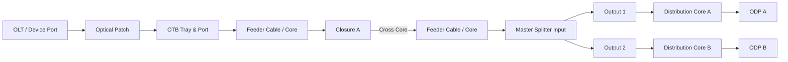
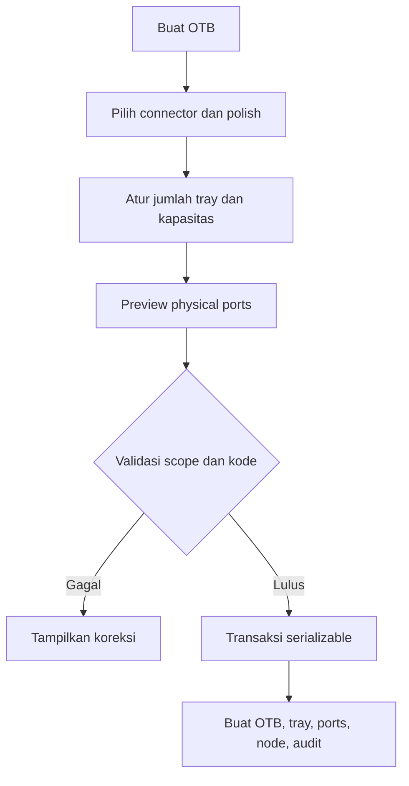
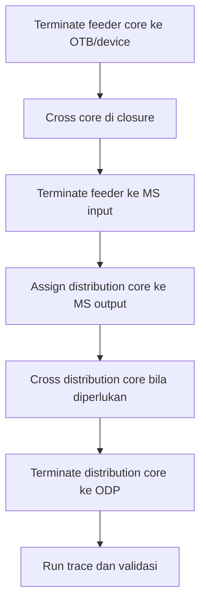
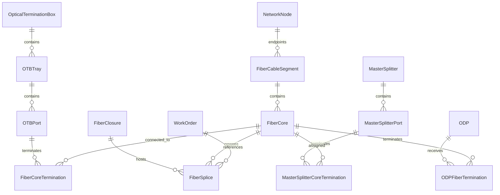

# PRD asli (Prisma) — arsip

Dokumen ini **bukan acuan kerja**. Ia disimpan apa adanya sebagai asal-usul
kebutuhan: dari sinilah aturan domain OTB/core-route/master-splitter datang.

Diterima 21 Agustus 2026 lewat `.orca/drops/`. Ditulis untuk app lain
(Prisma, produk "PERUMNET CRM & Operations"), dan klaim statusnya di §16
tidak berlaku di mana pun — diperiksa ke seluruh app PerumNet pada tanggal
yang sama.

**Acuan kerja yang benar ada di `docs/PRD-OTB-CORE-ROUTE-MASTER-SPLITTER.md`**
— versi yang sudah diterjemahkan ke Drizzle, tabel yang benar-benar ada, dan
peran yang benar-benar dipakai portal ini.

---

# Product Requirements Document" di bawah; tidak ada satu kata pun
> yang diubah, supaya bisa dibandingkan dengan aslinya.
>
> **Yang TIDAK berlaku di repo ini:**
>
> - **Stack.** PRD menulis Prisma, `npx prisma migrate deploy`, `npm run
>   db:seed`, dan runbook PowerShell. monitoring-noc memakai **Drizzle**,
>   migrasi di `drizzle/pg/`, dijalankan dengan `npx drizzle-kit generate` +
>   `npx drizzle-kit migrate`.
> - **§7 "Reuse dan Perubahan Domain Model".** Kolom "Existing—reuse/extend"
>   ditulis untuk app lain. Di sini `FiberRoute`, `FiberCableSegment`,
>   `FiberCore`, `FiberClosure`, `FiberSplice`, `OpticalTerminationBox`,
>   `OTBPort`, `NetworkNode`, `OpticalCircuit`, `DevicePort`, `SuperPop`,
>   `DataCenterRack`, dan `WorkOrder` **tidak ada satu pun**. Yang benar-benar
>   sudah ada: `odps`, `odp_ports`, `network_sites`, `olt_devices`, dan
>   `audit_logs`.
> - **§16 tabel status "Selesai" dan §16.1 "Status rollout aktual".**
>   Diperiksa 21 Agustus 2026 terhadap seluruh app PerumNet: `OTBTray`,
>   `MasterSplitter`, `MasterSplitterPort`, `MasterSplitterCoreTermination`,
>   dan `ODPFiberTermination` **tidak ada di repo mana pun** — nol model, nol
>   migrasi, nol route. `/fiber/otb/new` dan `/fiber/master-splitters/new`
>   yang §25 perintahkan dibuka: dua-duanya 404. Skrip
>   `security:verify-otb-route` yang §25 sebut tidak ada. Dua dokumen yang §26
>   tunjuk sebagai acuan (`…-DESIGN.md`, `…-IMPLEMENTATION.md`) tidak pernah
>   dibuat. **Perlakukan §16 sebagai rencana, bukan laporan.**
> - **§13 Permission Matrix.** Portal ini punya empat peran —
>   `admin` · `noc` · `engineer` · `manajemen` — tanpa scope company/branch.
>   Tujuh peran dan tiga belas permission di §13 tidak ada padanannya.
> - **§8.8 dan §16 fase I** (Work Order, OTDR). Tidak ada di portal ini dan
>   tidak direncanakan untuk fase mana pun sejauh ini.
>
> **Yang diadopsi:** aturan domain **§6** (pemisahan feeder/distribution, ODP
> sebagai endpoint, larangan split di closure normal, konektor dan polish
> terpisah, panjang dari cable segment, estimasi ≠ pengukuran, histori tidak
> dihapus) dan kebutuhan fungsional **§8**.
>
> **Satu penyimpangan yang disengaja dari §7.** Master Splitter **tidak**
> dibuat sebagai tabel terpisah. Di portal ini ia sudah ada sebagai
> `odps.role = 'MS'` — 63 baris produksi, rasio tersimpan di `capacity`,
> koordinat lengkap, kaskade lewat `parent_id`, port di `odp_ports`. Membuat
> `master_splitters` baru akan menduplikasi 63 baris nyata dan melanggar
> aturan PRD ini sendiri: *"Tidak boleh dibuat master paralel untuk ODP"*.
> Alasannya tertulis di `src/db/schema.ts` pada komentar tabel `odps`.
>
> **Rencana fase yang benar-benar dipakai** ada di
> `HANDOFF-BACKEND-KE-FRONTEND.md` §16, bukan di §16 dokumen ini. Acuan visual:
> `docs/gambar/otb-detail-*.jpeg`.

# Product Requirements Document

# OTB Core Route, Closure Cross-Connection, dan Master Splitter Integration

| Metadata | Nilai |
|---|---|
| Produk | PERUMNET CRM & Operations |
| Modul | Fiber Backbone & Core Management |
| Dokumen | PRD OTB Core Route, Closure Cross-Connection, dan Master Splitter |
| Versi | 1.0 |
| Tanggal | 21 Agustus 2026 |
| Pemilik produk | PERUMNET |
| Zona waktu | Asia/Makassar |
| Status produk | Phase A–J diimplementasikan; rollout database lokal menunggu PostgreSQL/Docker aktif |
| Sifat perubahan | Additive, mempertahankan data dan modul existing |

## 1. Ringkasan Eksekutif

Modul ini menyediakan pencatatan topologi fiber end-to-end yang dapat diaudit, mulai dari perangkat aktif, port perangkat, OTB, core feeder, closure, Master Splitter, core distribusi, hingga ODP.

Sistem harus dapat menjawab pertanyaan operasional berikut secara konsisten:

- Port perangkat mana yang terhubung ke suatu ODP?
- OTB, tray, port, kabel, core, dan closure mana yang dilewati?
- Apakah nomor core berubah ketika melewati closure?
- Master Splitter mana yang membagi feeder menjadi beberapa jalur distribusi?
- Berapa panjang rute fisik dan estimasi optical loss?
- Di titik mana terdapat jalur putus, loop, konflik occupancy, atau terminasi yang belum lengkap?
- Work Order dan pengguna mana yang melakukan perubahan topologi?
- Adakah hasil OTDR yang berkaitan dengan core pada jalur tersebut?

Prinsip utama domain adalah memisahkan feeder dan distribution. ODP selalu menjadi endpoint distribusi dan tidak pernah digunakan sebagai node penerus backbone atau feeder. Percabangan optik hanya boleh terjadi pada perangkat Master Splitter yang eksplisit, bukan pada closure biasa.

## 2. Latar Belakang dan Masalah

Data fiber yang hanya berbentuk nama kabel, catatan core, atau spreadsheet tidak cukup untuk mengelola jaringan yang berkembang. Tanpa hubungan fisik yang terstruktur, tim dapat mengalami:

- Kesulitan menelusuri jalur dari perangkat ke pelanggan.
- Core yang sama dipakai oleh dua koneksi aktif.
- Perubahan nomor core di closure tidak tercatat.
- Closure biasa dipakai sebagai split point tanpa perangkat splitter yang jelas.
- Panjang rute dihitung ganda atau hanya berupa perkiraan.
- ODP salah diperlakukan sebagai titik transit backbone.
- Data lapangan, Work Order, histori perubahan, dan hasil OTDR tidak saling terhubung.
- Perbaikan gangguan menjadi lambat karena teknisi harus menelusuri dokumen manual.

Modul ini memperbaiki masalah tersebut dengan graph topologi yang bersumber dari master existing, persistent physical ports, aturan occupancy server-side, trace dua arah, serta audit log yang tidak menghapus histori lama.

## 3. Tujuan Produk

### 3.1 Tujuan utama

1. Membuat representasi digital rute core dari device hingga ODP.
2. Memisahkan jalur feeder dan distribution secara tegas.
3. Mengelola OTB berdasarkan tray dan port fisik yang persisten.
4. Mendukung straight splice dan arbitrary cross-core pada closure.
5. Mencegah split pada closure normal.
6. Menjadikan Master Splitter sebagai satu-satunya perangkat percabangan optik eksplisit.
7. Menyediakan trace upstream dan downstream dengan diagnosis topologi.
8. Menghubungkan perubahan topologi dengan Work Order, pengguna, waktu, dan audit.
9. Mengintegrasikan peta, OTDR History, dan pencarian jaringan.
10. Menjaga kompatibilitas data Fiber, OTB, ODP, SuperPOP, perangkat, dan circuit yang sudah ada.

### 3.2 Indikator keberhasilan

- Seluruh OTB existing tetap memiliki ID dan nomor port yang sama setelah migrasi.
- Satu active output core tidak dapat dipakai oleh dua crossing aktif.
- Normal closure tidak dapat membuat koneksi one-to-many.
- Satu input Master Splitter dapat memiliki beberapa output independen.
- Setiap output Master Splitter dapat ditelusuri ke ODP yang berbeda.
- Trace ODP dapat kembali ke feeder, OTB, dan device bila datanya lengkap.
- Total panjang hanya menjumlahkan physical cable segment unik yang dilewati.
- Jalur rusak, loop, ambigu, dan terminasi tidak lengkap ditampilkan tanpa menyebabkan aplikasi crash.
- Seluruh mutation topology tersimpan dalam audit log.
- Tidak ada temuan P0/P1 sebelum go-live.

## 4. Ruang Lingkup

### 4.1 Termasuk

- Master OTB, tray, dan port.
- Connector type dan polish type yang dipisahkan.
- Cable category dan core purpose.
- Core termination pada OTB.
- Straight dan cross-core connection pada closure.
- Master Splitter, input/output port, dan core termination.
- Terminasi distribution core ke ODP.
- Feeder trace dan distribution trace.
- Trace dari Device Port, OTB Port, Fiber Core, Cable Segment, Network Node, Optical Circuit, Master Splitter Port, dan ODP.
- Fiber Map dengan perbedaan feeder dan distribution.
- Core Matrix dan cross-connection table.
- Work Order reference pada perubahan topologi.
- Audit history dan integrasi OTDR History.
- Role, permission, company scope, dan warehouse/branch scope.
- Migrasi additive dan backfill aman.
- Tampilan desktop dan mobile.

### 4.2 Tidak termasuk pada versi ini

- Auto-discovery perangkat jaringan secara langsung.
- Provisioning OLT/ONT ke controller jaringan.
- GIS/PostGIS advanced routing.
- Perhitungan optical budget live dari alat ukur.
- Parser file OTDR SOR otomatis.
- Prediksi fault location berbasis machine learning.
- Capacity planning otomatis berbasis forecast pelanggan.
- Penggantian master ODP, SuperPOP, rack, asset, atau Work Order existing.
- Penggunaan ODP sebagai pass-through feeder/backbone.

## 5. Pengguna dan Kebutuhan

| Pengguna | Kebutuhan utama |
|---|---|
| Super Admin | Konfigurasi penuh, koreksi data, permission, dan audit global. |
| Network Admin | Membuat OTB/MS, mengelola topology, crossing, termination, trace, dan map. |
| Fiber Admin | Mengelola kabel, core, splice, OTB, splitter, ODP termination, serta OTDR. |
| Warehouse Admin | Melihat dan mengelola data yang berkaitan dengan material/WO sesuai scope. |
| Management | Melihat topology, kapasitas, trace, risiko, dan histori tanpa mutation operasional. |
| Technician | Melihat map, trace, OTB/closure/ODP, dan OTDR sesuai assignment/scope. |
| Auditor | Melihat histori perubahan, Work Order referensi, dan before/after topology. |

## 6. Prinsip dan Batas Domain

### 6.1 Jalur feeder

Jalur feeder menggambarkan koneksi dari perangkat aktif ke titik pembagi distribusi.

```text
Device Port → Patch → OTB Port → Feeder Core
→ Closure/Crossing → Feeder Core
→ Master Splitter Input
```

Feeder dapat melewati lebih dari satu closure. Perubahan nomor core diperbolehkan dan harus dicatat sebagai edge aktual, misalnya Core 17 menjadi Core 23.

### 6.2 Jalur distribution

```text
Master Splitter Output → Distribution Core
→ Closure/Crossing → Distribution Core
→ ODP
```

Setiap output Master Splitter merupakan jalur independen. Trace satu output tidak boleh otomatis mencampur jalur output lainnya.

### 6.3 Topologi referensi



### 6.4 Aturan wajib

- ODP adalah endpoint distribusi.
- Closure normal tidak boleh membagi satu input menjadi beberapa output.
- Split hanya boleh dibuat melalui Master Splitter.
- Connector dan polish adalah atribut terpisah.
- Port fisik mempunyai identity permanen.
- Panjang total berasal dari cable segment, bukan teks manual pada trace.
- Estimated loss tidak boleh dilabel sebagai hasil pengukuran langsung.
- Histori lama tidak dihapus ketika koneksi diganti.

## 7. Reuse dan Perubahan Domain Model

| Konsep | Keputusan | Model |
|---|---|---|
| ODP dan port pelanggan | Existing—reuse | `ODP`, `ODPPort` |
| SUPERPOP, site, rack, device | Existing—reuse | `SuperPop`, `NetworkSite`, `DataCenterRack`, `DataCenterAsset` |
| Route, cable, core | Existing—extend | `FiberRoute`, `FiberCableSegment`, `FiberCore` |
| Closure dan splice | Existing—extend | `FiberClosure`, `FiberSplice` |
| OTB dan port | Existing—extend | `OpticalTerminationBox`, `OTBPort` |
| Device-to-core | Existing—reuse | `DevicePort`, patch, `FiberCoreTermination` |
| Node registry | Existing—extend | `NetworkNode` |
| Optical circuit | Existing—reuse | `OpticalCircuit` |
| OTDR | Existing—reuse | Session, measurement, event, attachment |
| Audit dan WO | Existing—extend | `AuditLog`, `WorkOrder` |
| OTB tray | New—required | `OTBTray` |
| Master Splitter | New—required | `MasterSplitter` |
| Splitter physical port | New—required | `MasterSplitterPort` |
| Splitter/core termination | New—required | `MasterSplitterCoreTermination` |
| ODP/core termination | New—required | `ODPFiberTermination` |

Tidak boleh dibuat master paralel untuk ODP, OTB, cable, core, closure, SuperPOP, device, atau Work Order.

## 8. Kebutuhan Fungsional

### 8.1 OTB Master dan Tray

#### FR-OTB-001 — Membuat OTB

Sistem harus menyediakan pembuatan OTB dengan:

- Company dan branch/site.
- Kode dan nama unik sesuai scope.
- Tipe connector: SC atau LC.
- Polish: UPC atau APC.
- Jumlah tray.
- Kapasitas per tray.
- Lokasi/node sumber.
- Koordinat opsional untuk OTB standalone.
- Status aktif/nonaktif.
- Alasan perubahan dan audit.

#### FR-OTB-002 — Default kapasitas

- SC menggunakan quick default 12 port per tray.
- LC menggunakan quick default 24 port per tray.
- User berwenang dapat menentukan kapasitas lain.
- Default tidak menjadi hard limit database.

#### FR-OTB-003 — Persistent physical ports

- Setiap tray dan port memiliki ID permanen.
- Port mempunyai nomor dalam tray dan nomor global kompatibilitas lama.
- Port existing dibackfill ke Tray 1 tanpa mengganti ID.
- Mengurangi kapasitas ditolak jika port yang akan hilang pernah terhubung atau memiliki histori.

#### FR-OTB-004 — Status port

Status sekurang-kurangnya mendukung available, used, reserved, inactive, faulty, dan damaged sesuai enum existing/extended. Port inactive/faulty/damaged tidak dapat digunakan untuk patch atau core termination baru.

### 8.2 Cable dan Core

#### FR-CBL-001 — Cable category

Cable harus mempunyai kategori:

- `BACKBONE`
- `FEEDER`
- `DISTRIBUTION`
- `DROPCORE`
- `INTERCONNECT`
- `OTHER`

Kategori dipisahkan dari route type agar fungsi fisik kabel tetap jelas.

#### FR-CBL-002 — Core purpose

Core mendukung purpose feeder dan distribution. Sistem harus menolak:

- Core distribution sebagai input feeder Master Splitter.
- Core feeder/backbone sebagai output distribution.
- Core non-distribution sebagai terminasi ODP.

#### FR-CBL-003 — Panjang rute

- Panjang tersimpan pada setiap physical cable segment.
- Total trace menjumlahkan segment unik aktif.
- Segment yang dilalui dua kali karena data loop tidak dihitung diam-diam sebagai jalur valid.
- Geometry yang hilang tidak boleh diganti garis perkiraan.

### 8.3 Closure Cross-Connection

#### FR-CLS-001 — Straight connection

Sistem mendukung mapping input dan output dengan nomor core yang sama.

#### FR-CLS-002 — Arbitrary cross-core

Sistem mendukung mapping berbeda, misalnya:

```text
Cable A / Core 17 → Cable B / Core 23
```

Trace harus mengikuti Core 23 setelah closure.

#### FR-CLS-003 — Occupancy

- Satu input core hanya mempunyai satu output aktif pada closure normal.
- Satu output core hanya ditempati satu mapping aktif.
- Koneksi identik aktif ganda ditolak.
- Preview dan commit harus melakukan validasi server-side.
- Bulk operation harus atomik.

#### FR-CLS-004 — Larangan split

Mutation `SPLIT` pada closure normal harus ditolak dari UI, API, server action, dan domain service. Larangan tidak cukup hanya disembunyikan di browser.

#### FR-CLS-005 — Histori crossing

Perubahan tidak menimpa record lama. Crossing lama dinonaktifkan, active occupancy key dilepas, dan crossing pengganti dibuat sebagai record baru dengan alasan, user, waktu, dan optional Work Order.

### 8.4 Master Splitter

#### FR-MS-001 — Master data

Master Splitter harus menyimpan:

- Company dan scope.
- Kode serta nama.
- Lokasi dan Network Node.
- Rasio, misalnya 1:4, 1:8, 1:16, atau custom.
- Jumlah input dan output terkonfigurasi.
- Connector dan polish.
- Status.
- Optional Work Order referensi.

#### FR-MS-002 — Input dan output

- Versi pertama memaksa satu feeder input.
- Jumlah output minimal dua.
- Input/output menjadi physical port persisten.
- Setiap port mempunyai direction, nomor, label, connector, polish, dan status.
- Satu port hanya memiliki satu active core termination.

#### FR-MS-003 — Assignment core

- Input hanya menerima core feeder.
- Output hanya menerima core distribution.
- Core aktif tidak dapat dipakai oleh dua active termination.
- Semua perubahan dijalankan dalam transaksi serializable.

#### FR-MS-004 — Split graph

Hubungan satu input ke beberapa output dibuat oleh trace engine berdasarkan perangkat Master Splitter yang sama. Sistem tidak membuat beberapa row `FiberSplice` palsu untuk mewakili split.

#### FR-MS-005 — Tujuan output

Tujuan output tidak disimpan sebagai teks duplikat. ODP tujuan dihitung dari trace distribution aktual.

### 8.5 Integrasi ODP

#### FR-ODP-001 — Endpoint tunggal

ODP existing menerima active distribution core melalui `ODPFiberTermination`.

#### FR-ODP-002 — Validasi scope

Branch/company ODP harus konsisten dengan jalur dan hak akses user. Server menolak terminasi lintas scope tanpa kewenangan.

#### FR-ODP-003 — Larangan pass-through

Tidak tersedia output feeder/backbone dari ODP. ODP tidak dapat menjadi node tengah pada feeder trace.

#### FR-ODP-004 — Upstream trace

Trace dari ODP harus dapat bergerak ke distribution core, closure, Master Splitter output/input, feeder, OTB, patch, dan device bila seluruh relasi tersedia.

### 8.6 Core Trace

#### FR-TRC-001 — Sumber trace

Trace menerima input:

- Device Port.
- OTB Port.
- Fiber Core.
- Cable Segment.
- Network Node.
- Optical Circuit.
- Master Splitter Port.
- ODP.

#### FR-TRC-002 — Mode trace

- `FEEDER`: perangkat/OTB menuju Master Splitter atau feeder endpoint.
- `DISTRIBUTION`: output Master Splitter menuju satu ODP.
- `UPSTREAM`: ODP menuju Master Splitter dan perangkat sumber.
- `FULL`: menampilkan seluruh physical step untuk pengguna berwenang.

#### FR-TRC-003 — Kandidat jalur

Jika input cable/node memiliki banyak core atau cabang, server mengembalikan kandidat dan UI meminta user memilih sebelum membuat trace penuh.

#### FR-TRC-004 — Step trace

Setiap step memuat sekurang-kurangnya:

- Sequence.
- Layer feeder/distribution.
- Node type, code, dan name.
- Incoming/outgoing cable.
- Tube, core number, dan color.
- Segment length.
- Splice/connector loss model.
- Direction dan status.
- Catatan dan timestamp bila relevan.

#### FR-TRC-005 — Status diagnosis

Trace mengembalikan salah satu status:

- `COMPLETE`
- `ROUTE_END`
- `BROKEN_ROUTE`
- `CORE_ROUTE_LOOP_DETECTED`
- `AMBIGUOUS`

Split pada Master Splitter ditandai sebagai explicit split dan bukan anomaly. Split di luar perangkat splitter ditandai sebagai masalah topology.

#### FR-TRC-006 — Optical loss

- Estimated loss merupakan hasil penjumlahan model splice/connector.
- Hasil OTDR tetap ditampilkan sebagai measurement terpisah.
- UI harus membedakan “estimasi” dan “hasil pengukuran”.

### 8.7 Fiber Map

#### FR-MAP-001 — Layer

Peta menyediakan layer atau filter:

- Feeder.
- Distribution.
- OTB.
- Closure.
- Master Splitter.
- ODP.
- SUPERPOP/POP/ODC/RK sesuai master existing.
- Cable category dan status.

#### FR-MAP-002 — Visual

- Feeder dan distribution dibedakan secara visual.
- Node aktif dan pasif tetap mengikuti design system existing.
- Trace terpilih dapat di-highlight.
- Geometry hilang menghasilkan warning dan daftar record, bukan garis asumsi.

#### FR-MAP-003 — Popup

Popup node/kabel memuat kode, tipe, kapasitas, status, core terpakai/bebas/fault, endpoint, panjang, dan tautan ke detail, matrix, trace, OTDR, atau directions sesuai konteks.

### 8.8 History, Work Order, dan OTDR

#### FR-HIS-001 — Audit

Audit wajib untuk:

- OTB/tray/port creation atau update.
- Master Splitter creation atau update.
- Core assignment/release.
- Closure crossing create/replace/deactivate.
- ODP termination create/replace/deactivate.
- Perubahan status topology.

#### FR-HIS-002 — Work Order

Mutation dapat membawa referensi Work Order. Sistem menyimpan alasan perubahan seperti instalasi baru, repair, core fault, reroute, maintenance, capacity upgrade, atau lainnya.

#### FR-OTDR-001 — OTDR History

Core pada trace menampilkan ringkasan sesi OTDR terbaru dan tautan ke history. OTDR event, measurement, attachment, dan access control existing tetap menjadi source of truth.

## 9. Halaman dan Pengalaman Pengguna

| Route | Fungsi |
|---|---|
| `/fiber` | Fiber Map dan dashboard map-first. |
| `/fiber/backbone` | Hub Backbone, node, cable, core, OTB, MS, OTDR, circuit. |
| `/fiber/otb` | Daftar OTB. |
| `/fiber/otb/new` | Pembuatan OTB/tray/port. |
| `/fiber/otb/[code]` | Detail OTB dan tray/port matrix. |
| `/fiber/master-splitters` | Daftar dan filter Master Splitter. |
| `/fiber/master-splitters/new` | Pembuatan Master Splitter. |
| `/fiber/master-splitters/[code]` | Detail, port matrix, feeder input, dan distribution output. |
| `/fiber/core-trace` | Pencarian dan trace topology. |
| `/fiber/closures/[code]` | Detail closure dan cross-connection matrix. |
| `/fiber/otdr` | OTDR History dan event. |

### 9.1 OTB detail

Header menampilkan identitas OTB, lokasi, connector/polish, kapasitas, used/free/fault, dan aksi trace. Tray tampil sebagai bagian horizontal ringkas pada desktop dan kartu per tray pada mobile. Setiap port memiliki badge status dan tautan ke patch/core.

### 9.2 Closure matrix

Desktop menggunakan tabel:

```text
Input cable/core/color → Output cable/core/color → Purpose → Service → Status
```

Mobile menggunakan kartu agar tidak terjadi horizontal overflow. Tersedia pencarian, filter, preview, single crossing, dan bulk mapping sesuai permission.

### 9.3 Master Splitter detail

Detail menampilkan satu feeder input, daftar output, core distribusi, hasil trace/ODP tujuan, port status, Work Order, dan audit timeline. Output bebas tetap terlihat untuk perencanaan kapasitas.

### 9.4 Empty, loading, dan error state

Semua halaman wajib memiliki:

- Skeleton/loading yang tidak mengubah layout secara ekstrem.
- Empty state dengan penjelasan dan aksi yang sesuai permission.
- Error state yang tidak membocorkan stack trace.
- Permission denied yang jelas.
- Warning untuk geometry atau relasi yang belum lengkap.
- Tampilan mobile tanpa horizontal overflow.

## 10. Alur Kerja Utama

### 10.1 Registrasi OTB



### 10.2 Pembangunan feeder dan distribution



### 10.3 Perubahan core saat maintenance

1. Operator membuka closure/core matrix.
2. Memilih mapping aktif yang akan diganti.
3. Mengisi alasan dan Work Order.
4. Sistem membuat preview occupancy dan dampak trace.
5. Operator melakukan commit.
6. Sistem menonaktifkan koneksi lama dan membuat koneksi baru secara atomik.
7. Audit before/after dan referensi WO disimpan.
8. Trace dan map di-invalidasi agar menampilkan jalur baru.

## 11. Arsitektur Data Tingkat Tinggi



### 11.1 Database constraints penting

- Network Node mempunyai tepat satu source master yang valid.
- Active occupancy key mencegah satu port/core side dipakai ganda.
- Projected duplicate active termination ditolak pada database dan service.
- Master Splitter mempunyai satu input dan minimal dua output pada versi awal.
- `ODPFiberTermination` hanya menerima distribution core.
- Typed relation dan foreign key mempertahankan referential integrity.
- Existing ID tidak diubah oleh backfill.

## 12. Interface Server

### 12.1 Endpoint existing/extended

- `GET /api/fiber/trace`
- `POST /api/fiber/connections/preview`
- `POST /api/fiber/connections/commit`
- Endpoint topology/attachment existing yang relevan.

### 12.2 Server actions

Server action menangani:

- Pembuatan OTB/tray/ports.
- Pembuatan Master Splitter/ports.
- Assignment/release core pada MS input/output.
- Terminasi/release distribution core pada ODP.
- Mutation closure connection.

Semua mutation harus:

1. Memerlukan autentikasi.
2. Memeriksa permission.
3. Memeriksa company dan branch/warehouse scope.
4. Memvalidasi status entity.
5. Memvalidasi category/purpose core.
6. Memeriksa occupancy dan concurrency.
7. Memerlukan alasan perubahan.
8. Menyimpan audit.
9. Berjalan dalam transaksi database yang sesuai, menggunakan serializable untuk occupancy-sensitive mutation.

## 13. Permission Matrix

Permission utama:

- `fiber.view`
- `fiber.map.view`
- `fiber.trace`
- `fiber.otb.view`
- `fiber.otb.manage`
- `fiber.connection.manage`
- `fiber.splice.edit`
- `fiber.splice.bulk`
- `fiber.master_splitter.view`
- `fiber.master_splitter.manage`
- `fiber.distribution.manage`
- `fiber.otdr.view`
- `fiber.history.view`

| Kemampuan | Super Admin | Network/Fiber Admin | Management | Technician | Warehouse Admin |
|---|---:|---:|---:|---:|---:|
| Lihat map/trace | Ya | Ya | Ya | Scope | Scope |
| Kelola OTB | Ya | Ya | Tidak | Tidak | Sesuai permission |
| Kelola crossing | Ya | Ya | Tidak | Tidak | Tidak default |
| Kelola Master Splitter | Ya | Ya | Tidak | Tidak | Tidak default |
| Terminasi distribution ke ODP | Ya | Ya | Tidak | Tidak | Tidak default |
| Lihat OTDR | Ya | Ya | Ya/scope | Scope | Scope |
| Lihat audit | Ya | Ya | Ya | Terbatas | Scope |

Permission global tidak menghilangkan pemeriksaan company/branch scope. Akses direct URL dan endpoint harus menghasilkan `403` jika tidak berwenang.

## 14. Audit, Keamanan, dan Integritas

- UI tidak menjadi sumber kebenaran authorization atau occupancy.
- Semua mutation divalidasi kembali di server.
- Tidak ada hard-delete untuk koneksi yang telah memiliki histori.
- Before/after, user, waktu, reason, entity, dan Work Order dicatat.
- Detail teknis hanya tersedia untuk user terautentikasi dan berizin.
- Query trace dibatasi scope dan jumlah hop untuk mencegah traversal tidak terkendali.
- Input code, ID, reason, dan filter divalidasi.
- File OTDR tetap memakai private storage dan endpoint terlindungi.
- Error response tidak menampilkan credential, path storage, atau stack trace produksi.
- Perubahan topology sensitif memakai transaksi dan unique constraint untuk mencegah race condition.

## 15. Kebutuhan Nonfungsional

### 15.1 Performa

- Daftar menggunakan pagination/filter server-side.
- Trace maksimum 500 hop dan memiliki loop detection.
- Map hanya memuat geometry yang diperlukan oleh viewport/filter bila volume data membesar.
- Query topology menggunakan index untuk code, node, cable, core, status, dan active key.

### 15.2 Keandalan

- Commit bulk bersifat all-or-nothing.
- Request berulang tidak membuat koneksi aktif ganda.
- Kegagalan audit atau constraint membatalkan mutation utama.
- Data lama tetap dapat dibaca selama rollout transisi.

### 15.3 UX dan aksesibilitas

- Desktop dan mobile responsif.
- Status tidak hanya dibedakan berdasarkan warna.
- Tabel teknis berubah menjadi kartu pada layar kecil.
- Form dapat digunakan dengan keyboard.
- Konfirmasi menampilkan dampak sebelum mutation.
- Empty/error/loading/denied state tersedia.

### 15.4 Observability

- Kegagalan trace, occupancy conflict, migration anomaly, dan mutation error dicatat tanpa data rahasia.
- Audit dapat dicari berdasarkan entity, user, Work Order, dan waktu.

## 16. Fase Implementasi

| Fase | Fokus | Deliverable | Gate | Status kode |
|---|---|---|---|---|
| A | Audit dan schema | Reuse matrix, schema additive, migration/backfill | Prisma validate/generate | Selesai |
| B | OTB | OTB master, tray, port, connector/polish | Default SC/LC dan persistent port | Selesai |
| C | Cable/core | Category dan purpose | Validasi feeder/distribution | Selesai |
| D | Closure | Straight, cross-core, occupancy, no split | Atomic commit dan negative test | Selesai |
| E | Trace engine | Feeder/distribution graph | Loop/broken/ambiguous diagnosis | Selesai |
| F | Map dan matrix | Category layer, node, trace overlay | Missing geometry warning | Selesai |
| G | Master Splitter | Master, physical port, termination | Input/output independen | Selesai |
| H | ODP integration | Distribution termination dan upstream trace | ODP tetap endpoint | Selesai |
| I | History/WO/OTDR | Audit, WO reference, OTDR link | Non-destructive history | Selesai |
| J | Hardening | Permission, regression, build | Tidak ada P0/P1 | Lulus pada code/build |

### 16.1 Status rollout aktual

- Prisma format/validate/generate: lulus.
- Focused test OTB/route/splitter: 8/8 lulus.
- Optical regression: 5/5 lulus.
- Fiber Phase 1 regression: 6/6 lulus.
- Fiber security regression: 6/6 lulus.
- OTDR security regression: 7/7 lulus.
- TypeScript: lulus.
- Production build: lulus.
- Migration deploy ke PostgreSQL lokal: belum dijalankan karena Docker Engine tidak aktif ketika verifikasi.
- Seed dua kali terhadap PostgreSQL: menunggu database aktif.

## 17. Strategi Migrasi dan Backfill

1. Buat backup database sebelum deploy.
2. Terapkan migration additive tanpa menghapus kolom/model existing.
3. Tambahkan enum dan tabel baru.
4. Backfill cable category berdasarkan route type yang dapat dipastikan.
5. Backfill OTB existing ke Tray 1.
6. Pertahankan ID dan nomor global port lama.
7. Backfill company/location OTB bila relasinya pasti.
8. Buat Network Node pasif untuk OTB yang memenuhi data wajib.
9. Record ambigu tidak ditebak; masukkan sebagai migration issue untuk review.
10. Jalankan seed idempotent dua kali.
11. Validasi jumlah OTB, port, cable, core, splice, ODP, circuit, dan OTDR sebelum/sesudah.

Rollback aplikasi menggunakan versi kode sebelumnya hanya bila schema additive masih kompatibel. Data yang sudah dibuat pada model baru tidak boleh dihapus sebagai rollback otomatis; recovery mengikuti backup dan runbook database.

## 18. Acceptance Criteria

### 18.1 OTB

- [ ] OTB SC dapat dibuat dengan default 12 port/tray.
- [ ] OTB LC dapat dibuat dengan default 24 port/tray.
- [ ] Kapasitas custom dapat disimpan.
- [ ] Connector dan polish tersimpan terpisah.
- [ ] OTB lama masuk Tray 1 tanpa perubahan ID port.
- [ ] Port inactive/faulty/damaged ditolak untuk koneksi baru.

### 18.2 Closure

- [ ] Core 17 ke Core 17 dapat dibuat.
- [ ] Core 17 ke Core 23 dapat dibuat dan trace mengikuti Core 23.
- [ ] Output yang sudah ditempati ditolak.
- [ ] Normal closure one-to-many ditolak.
- [ ] Bulk mapping gagal seluruhnya jika satu row konflik.
- [ ] Penggantian mapping mempertahankan histori lama.

### 18.3 Master Splitter dan ODP

- [ ] MS dengan satu input dan beberapa output dapat dibuat.
- [ ] Input non-feeder ditolak.
- [ ] Output non-distribution ditolak.
- [ ] Dua output dapat menuju dua ODP berbeda.
- [ ] Satu output/core tidak dapat diterminasi ganda.
- [ ] ODP tidak dapat menjadi feeder pass-through.

### 18.4 Trace dan map

- [ ] Device-to-ODP trace lengkap dapat ditampilkan.
- [ ] ODP upstream trace mencapai device bila data lengkap.
- [ ] Loop dideteksi dan tidak menyebabkan proses tanpa akhir.
- [ ] Missing edge menghasilkan route end/broken route yang informatif.
- [ ] Multi-candidate meminta pilihan user.
- [ ] Physical segment unik menghasilkan total panjang yang tepat.
- [ ] Estimated loss dan OTDR measurement dibedakan.
- [ ] Feeder/distribution dapat dibedakan pada map.
- [ ] Missing geometry ditampilkan sebagai warning.

### 18.5 Security dan audit

- [ ] Unauthenticated request ditolak.
- [ ] User tanpa permission mendapat 403.
- [ ] Mutation lintas scope ditolak.
- [ ] Concurrent assignment tidak menghasilkan occupancy ganda.
- [ ] Setiap topology mutation memiliki audit before/after.
- [ ] Work Order dan reason tersimpan bila diwajibkan.

## 19. Skenario Pengujian Kritis

1. Straight splice A/C17 ke B/C17.
2. Cross splice A/C17 ke B/C23.
3. Jalur melewati beberapa closure dengan total panjang tepat.
4. Missing outgoing relation.
5. Loop CL1 → CL2 → CL1.
6. Normal closure split attempt.
7. Master Splitter input-to-many-output.
8. Output 1 ke ODP-A dan Output 2 ke ODP-B.
9. Trace ODP-B ke perangkat sumber.
10. Core input/output yang sudah occupied.
11. Dua operator melakukan assignment bersamaan.
12. Perubahan topology dengan dan tanpa Work Order sesuai policy.
13. User mencoba mengakses branch lain.
14. Kabel tanpa geometry pada map.
15. OTDR event tersedia dan tidak tersedia pada trace.
16. Migration diulang dan seed dijalankan dua kali.

## 20. KPI Operasional

Setelah rollout, dashboard/report dapat mengukur:

- Jumlah OTB dan port per status.
- Kapasitas port terpakai dan tersedia.
- Core feeder/distribution terpakai, bebas, dan fault.
- Master Splitter utilization per output.
- ODP dengan distribution termination lengkap/tidak lengkap.
- Persentase jalur yang dapat di-trace end-to-end.
- Jumlah broken route, loop, ambiguity, dan orphan termination.
- Jumlah perubahan topology per Work Order.
- Core dengan OTDR terbaru/kedaluwarsa/belum pernah diukur.
- Rata-rata waktu diagnosis gangguan sebelum dan setelah modul digunakan.

## 21. Risiko dan Mitigasi

| Risiko | Dampak | Mitigasi |
|---|---|---|
| Data lama ambigu | Node atau category salah | Jangan menebak; masukkan migration issue untuk review. |
| Occupancy race | Core dipakai ganda | Unique active key dan transaksi serializable. |
| Closure dipakai untuk split | Trace tidak valid | Tolak SPLIT di seluruh mutation layer. |
| ODP menjadi transit | Domain distribusi rusak | ODP hanya memiliki termination endpoint. |
| Geometry tidak lengkap | Map menyesatkan | Warning dan larangan menggambar garis asumsi. |
| Estimasi dianggap measurement | Keputusan teknis salah | Label jelas dan pisahkan OTDR measurement. |
| Perubahan menghapus histori | Audit tidak lengkap | Non-destructive replacement dan immutable audit. |
| Permission hanya di UI | Kebocoran/unauthorized mutation | Enforcement server-side dan negative test. |
| Migrasi belum diuji di DB | Risiko deployment | Backup, Docker/PostgreSQL, migrate deploy, seed dua kali, regression. |

## 22. Dependensi

- PostgreSQL dan Prisma.
- Next.js application existing.
- Auth, role, permission, company/warehouse scope existing.
- FiberRoute, cable/core, closure/splice, OTB, ODP, NetworkNode, device port, circuit, OTDR, Work Order, dan AuditLog existing.
- Leaflet/Fiber Map existing.
- Docker untuk rollout dan preview database lokal.

## 23. Asumsi

- ODP tetap endpoint terakhir jaringan distribusi.
- Master Splitter adalah perangkat pasif eksplisit.
- Satu feeder input per Master Splitter cukup untuk versi pertama.
- Cable segment merupakan sumber resmi panjang rute.
- Data optical live hanya berasal dari alat/sesi OTDR, bukan formula estimasi.
- Existing completed records tidak dihapus atau dinomori ulang.
- Semua perubahan topology dilakukan oleh pengguna terautentikasi.

## 24. Definition of Done

Modul dinyatakan selesai dan siap dipakai ketika:

1. Seluruh acceptance criteria lulus.
2. Migration additive berhasil diterapkan pada backup/clone database.
3. Seed dijalankan dua kali tanpa duplikasi.
4. OTB existing, port, cable, core, splice, ODP, circuit, dan OTDR terverifikasi tidak hilang.
5. Prisma validate/generate lulus.
6. TypeScript dan production build lulus.
7. Focused test, regression, security test, dan concurrency test lulus.
8. Halaman OTB, Master Splitter, closure matrix, map, trace, dan OTDR dapat dibuka.
9. Tidak ada temuan P0/P1.
10. Network/Fiber Admin menyetujui sampel trace lapangan.
11. Backup dan rollback runbook tersedia.

## 25. Runbook Rollout Lokal

Setelah Docker Desktop dan PostgreSQL aktif:

```powershell
npm run db:start
npx prisma migrate deploy
npm run db:seed
npm run db:seed
npm run security:verify-otb-route
npx tsc --noEmit
npm run build
```

Verifikasi manual minimum:

1. Buka `/fiber/otb/new` dan buat satu OTB uji.
2. Buka `/fiber/master-splitters/new` dan buat satu MS uji.
3. Hubungkan feeder core ke input MS.
4. Hubungkan dua output ke dua distribution core berbeda.
5. Terminasikan masing-masing jalur ke ODP berbeda.
6. Jalankan downstream dan upstream trace.
7. Periksa Fiber Map dan OTDR History.
8. Periksa Audit Log dan referensi Work Order.

## 26. Dokumen Terkait

- `docs/fiber/OTB-CORE-ROUTE-MASTER-SPLITTER-DESIGN.md`
- `docs/fiber/OTB-CORE-ROUTE-MASTER-SPLITTER-IMPLEMENTATION.md`
- `docs/fiber/FIBER-BACKBONE-DESIGN.md`
- `docs/PRD-PERUMNET-CRM-OPERATIONS.md`

---

Dokumen ini menjadi acuan bersama Product, Network, Fiber, Engineering, QA, Management, dan tim implementasi. Perubahan terhadap aturan domain utama—terutama status ODP sebagai endpoint dan larangan split pada closure normal—harus melalui review lintas tim sebelum diterapkan.
